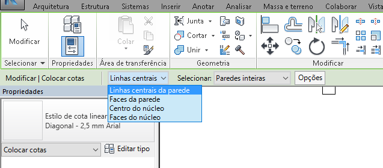
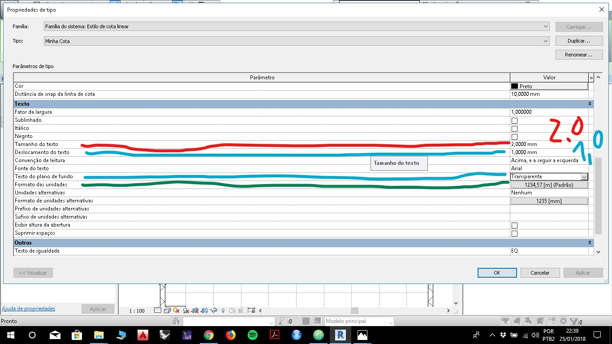
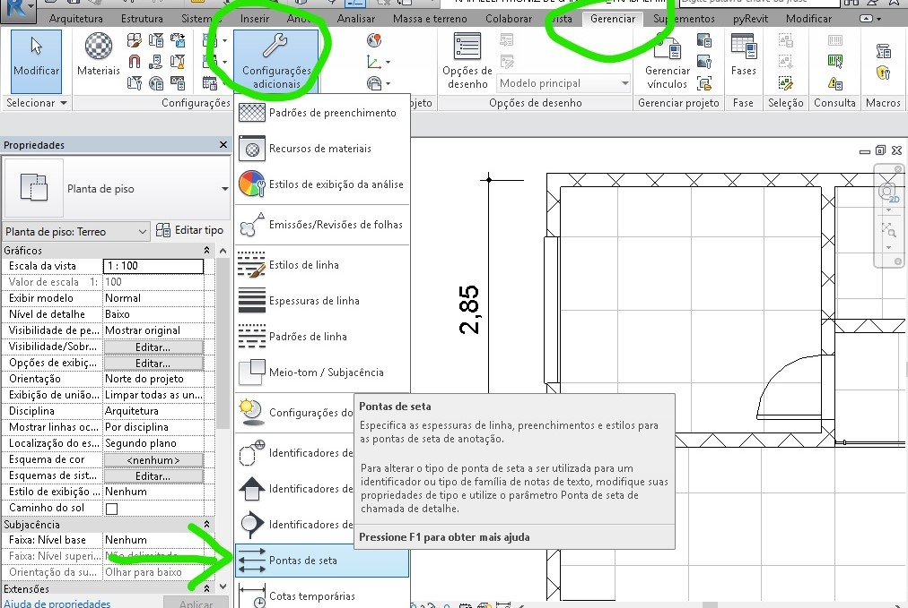

#### Utilizando Cotas

As cotas no Revit são famílias do sistema.
Para utilizar uma cota, na aba Anotar e clique na opção cota alinhada.

A cota alinhada é a mais utilizada na maioria dos projetos, seu atalho padrão é DI.

Na barra de opções podemos escolher como cotar uma parede de acordo com seus eixos ou suas faces.

Também, em alguns casos, podemos cotar paredes inteiras automaticamente ou selecionar os pontos individualmente

Experimentando um pouco com estas opções e clicando nos objetos do desenho, é possível entender como cotar um desenho.

#### Configurando Cotas

A configuração de cota que são instaladas junto com o Revit, contudo, precisam de ajustes.

Com o comando de cotas ativado, clique em **editar tipo** na paleta de propriedades.

Renomeie o Tipo antes de começar a edição.

Alterações recomendadas dos gráficos das cotas:

    - Extensão da linha de cota = 1,0 mm
    - Controle da linha de chamada da cota = fixo para a linha de cota
    - Comprimento da linha de chamada de cota = 4 ou 5 mm
    - Extensão da linha de chamada de cota = 1,0 mm

Alterações recomendadas nos textos das cotas:

    - Tamanho do Texto = 2 mm
    - Deslocamento do texto = 0,5 mm
    - Texto do pano de fundo = Transparente
    - Formato das unidades = metros e centímetros
    - Arredondamento = o mais próximo de 1 cm

Com isso sua cota está razoavelmente configurada. Apenas o *Tick* ou *dot* que deve ser ajustado em outro local.

#### Configurando a Marca da cota

Na aba **Gerenciar**, clique no botão **configurações adicionais** e em seguida procure a opção **pontas de setas**.

Na caixa de diálogo das pontas de seta **renomeie e salve o tipo**. Neste exemplo vou utilizar um ponto.

    - Estilo de seta = pontilhado
    - Preenchimento da Marca de Revisão = Marque a caixa
    - tamanho da marca de revisão = 0,5 mm

Salve as alterações e volte para a edição do tipo da cota.

    - Procure a opção Marca de revisão e altere para o nome do tipo de Ponta de seta que você salvou.
    - Salve as alterações.

Sua cota está configurada. Ajuste as medidas de acordo com as normas e seu gosto pessoal.
