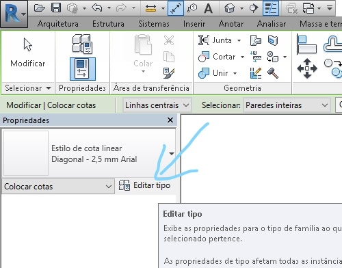
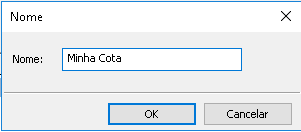
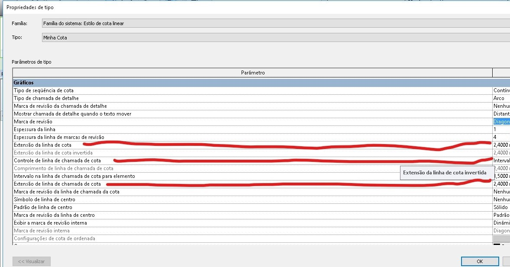
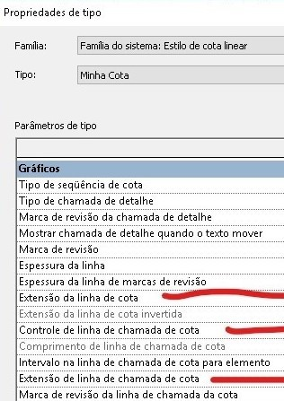
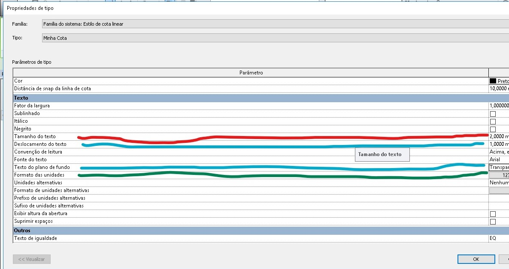
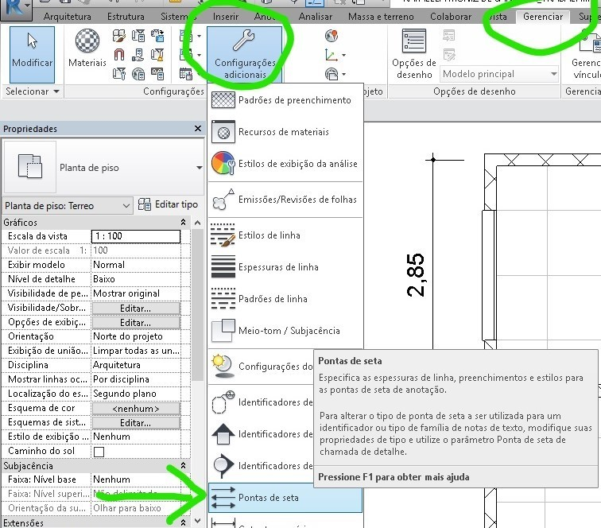
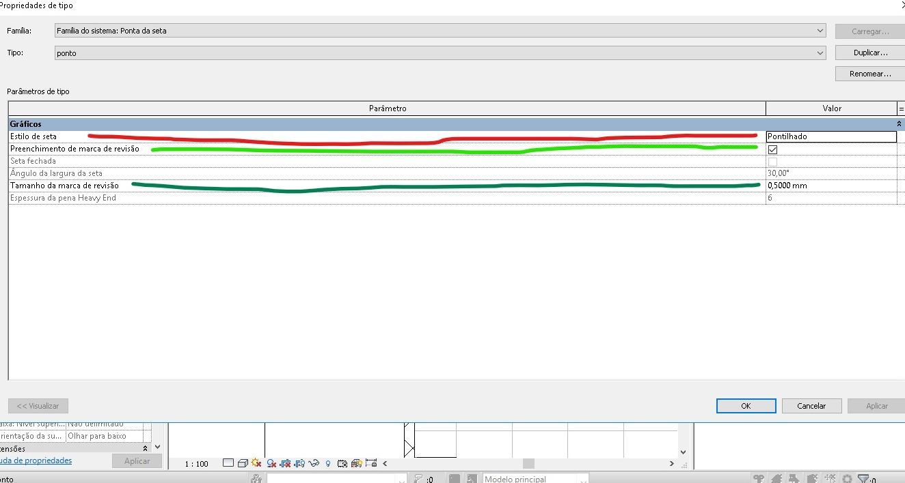
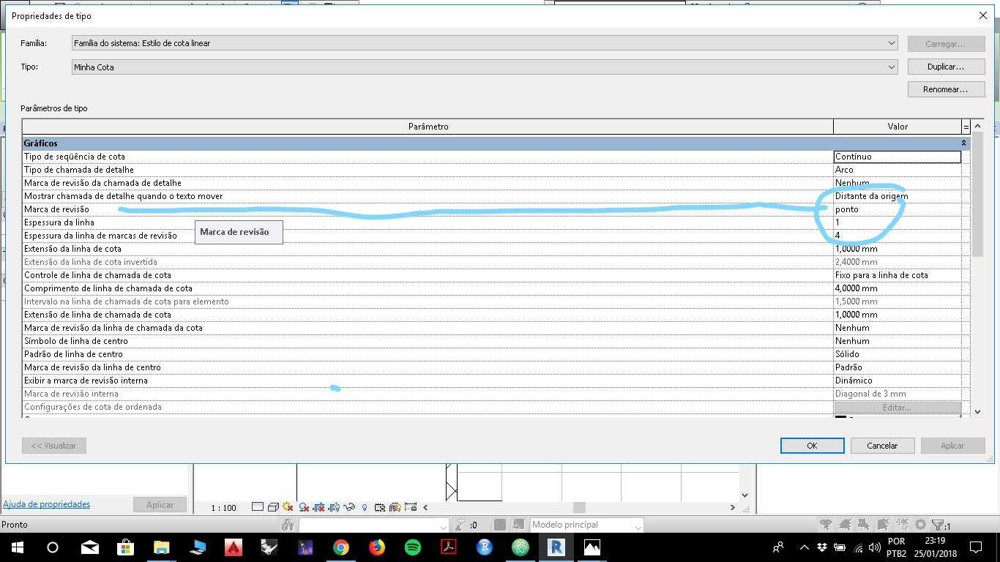

# Utilizando Cotas

As cotas no Revit são famílias do sistema.
Para utilizar uma cota, na aba Anotar e clique na opção cota alinhada.

____

____

A cota alinhada é a mais utilizada na maioria dos projetos, seu atalho padrão é DI.

Na barra de opções podemos escolher como cotar uma parede de acordo com seus eixos ou suas faces.

____

____

Também, em alguns casos, podemos cotar paredes inteiras automaticamente ou selecionar os pontos individualmente

____

____

Experimentando um pouco com estas opções e clicando nos objetos do desenho, é possível entender como cotar uma planta.

## Configurando Cotas

A configuração de cota que são instaladas junto com o Revit, contudo, precisam de ajustes.

Com o comando de cotas ativado, clique em **editar tipo** na paleta de propriedades.

____

____

Renomeie o Tipo antes de começar a edição.

____

____

____

### Elementos gráficos da cota

____

____

Alterações recomendadas dos gráficos das cotas:

    - Extensão da linha de cota = 1,0 mm
    - Controle da linha de chamada da cota = fixo para a linha de cota
    - Comprimento da linha de chamada de cota = 4 ou 5 mm
    - Extensão da linha de chamada de cota = 1,0 mm

____

### Elementos textuais das cotas

____

____

Alterações recomendadas nos textos das cotas:

    - Tamanho do Texto = 2 mm
    - Deslocamento do texto = 0,5 mm
    - Texto do pano de fundo = Transparente
    - Formato das unidades = metros e centímetros
    - Arredondamento = o mais próximo de 1 cm

Com isso sua cota está razoavelmente configurada. Apenas o *Tick* ou *dot* que deve ser ajustado em outro local.

### Configurando a Marca da cota

Na aba **Gerenciar**, clique no botão **configurações adicionais** e em seguida procure a opção **pontas de setas**.

____

____

Na caixa de diálogo das pontas de seta **renomeie e salve o tipo**. Neste exemplo vou utilizar um ponto.

____

____

    - Estilo de seta = pontilhado
    - Preenchimento da Marca de Revisão = Marque a caixa
    - tamanho da marca de revisão = 0,5 mm

Salve as alterações e volte para a edição do tipo da cota.

____

____

- Procure a opção Marca de revisão e altere para o nome do tipo de Ponta de seta que você salvou.
- Salve as alterações.

Sua cota está configurada. Os valores podem ser reajustados de acordo com as normas e seu gosto pessoal.
