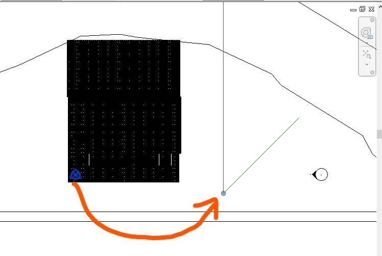
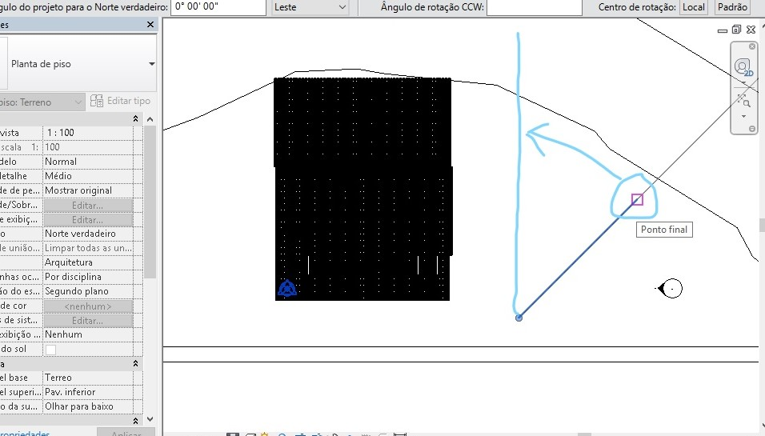

### Norte verdadeiro e norte de projetos

O Revit trabalha com dois conceitos de norte.

Um deles é o norte de projeto. Este não aponta para a direção geográfica, apenas indica a orientação em que seu projeto será desenhado e as quatro orientações das fachadas.

Geralmente começamos um projeto na posição que deixa a maior parte dos elementos paralelos aos eixos vertical e/ou horizontal das plantas.

Ajustar o ângulo do norte verdadeiro é importante para a orientação do projeto e, principalmente para realizar estudos de sombra.

Para colocar o norte verdadeiro na direção correta e preciso saber o ângulo entre o norte verdadeiro e os eixos de desenho, ou encontrar uma linha que seja paralela a este.

na figura acima, imagine que a linha de modelo em verde marca a direção do norte verdadeiro.

Antes de ajustar o valor, abra sua vista de **Terreno** (site) e, na paleta de propriedades ajuste a opção **orientação** para **Norte Verdadeiro**

Na aba **Gerenciar** procure o painel **Localização do Projeto** e o comando **Rotacionar Norte Verdadeiro**

Quando o comando é acionado uma linha aparece e a posição do ponteiro do *mouse* indica a nova direção do norte verdadeiro.

No extremo fixo da linha existe um ponto azul. Coloque o ponteiro do *mouse* neste ponto e arraste ate o ponto inicial da linha de referência. Quando a símbolo de end point aparecer, clique para reposicionar a linha de rotação.

Em seguida clique no outro extremo da linha. Rotacione a linha até que ela esteja alinhada com o eixo vertical do desenho. Clique o botão esquerdo do mouse indicando a nova direção do norte.

Agora a vista está orientada para o norte verdadeiro. A vista pode ser reorientada para o norte de projeto na opção **orientação** da **paleta de propriedades** da vista.

Com o norte verdadeiro configurado, qulaquer vista de planta pode ser orientada para o norte verdadeiro ou norte de projeto na **paleta de propriedades** da vista.

### Editando Símbolo de Norte

Para inserir um símbolo de indicação de norte, na aba **Anotar**, no painel **Simbolos**, procure o comando **Simbolo**

Os *Templates* instalados com o Revit não carregam nenhuma família de símbolos. 
